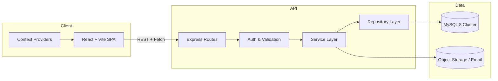
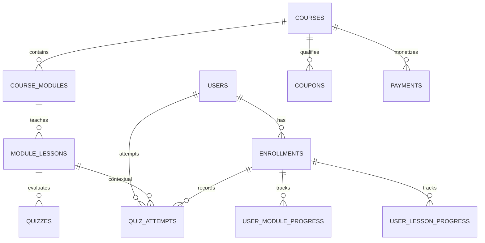
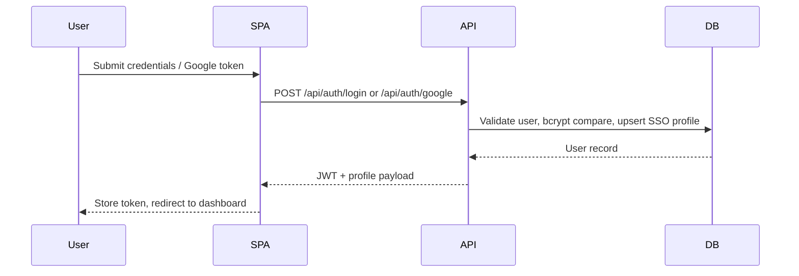
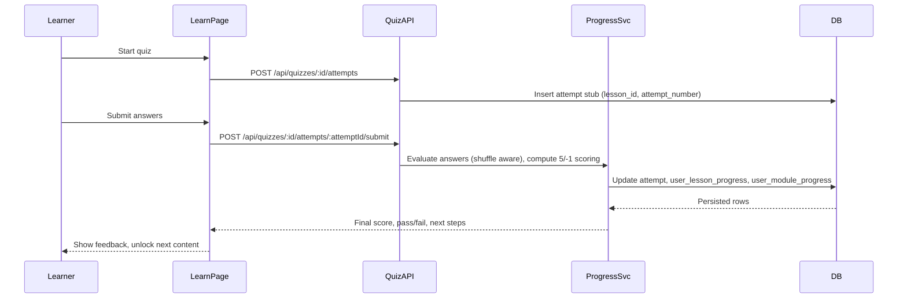

# 📚 JNTU GV Certification Platform

An end-to-end learning management platform combining a React + Vite frontend, an Express + Drizzle ORM backend, and a MySQL 8 datastore. The system supports student enrollment, lesson consumption with quiz tracking, administrative operations, and transactional emails.

---

## Table of Contents
1. [Quickstart](#quickstart)
2. [Architecture Overview](#architecture-overview)
3. [Backend Guide](#backend-guide)
4. [Database Reference](#database-reference)
5. [Frontend Guide](#frontend-guide)
6. [Feature Flows](#feature-flows)
7. [Operations & Tooling](#operations--tooling)
8. [Troubleshooting](#troubleshooting)
9. [Future Enhancements](#future-enhancements)
10. [Appendix](#appendix)

---

## Quickstart

### Prerequisites

| Tool | Version | Purpose |
|------|---------|---------|
| Node.js | 20.x LTS | Builds and serves both apps |
| npm | Bundled with Node | Dependency management |
| MySQL | 8.x | Primary relational store |
| Git | Latest | Version control |
| REST client (Postman/Thunder Client) | Optional | Manual API testing |

Verify local tooling:

```bash
node --version
npm --version
mysql --version
```

### Setup in Minutes

```bash
# 1. Clone and enter the project
git clone <repo-url>
cd saas-lms

# 2. Install shared dependencies
npm install

# 3. Provision the database (run once)
mysql -u root -p -e "CREATE DATABASE IF NOT EXISTS jntugv_certification CHARACTER SET utf8mb4 COLLATE utf8mb4_unicode_ci;"

# 4. Bootstrap schema, indexes, and seed admin (idempotent)
node scripts/init-db.mjs

# 5. Start backend and frontend in two terminals
npm run dev:backend   # or node backend/server.js
npm run dev           # Vite dev server
```

### Environment Variables

Create a `.env` file in the repository root before starting servers.

| Variable | Description |
|----------|-------------|
| DB_HOST, DB_PORT | MySQL host & port |
| DB_USER, DB_PASSWORD | Database credentials |
| DB_NAME | Database name (default `jntugv_certification`) |
| PORT | Backend port (default `3000`) |
| JWT_SECRET | HMAC secret for auth tokens |
| SMTP_HOST / SMTP_PORT / SMTP_EMAIL / SMTP_PASSWORD / SMTP_FROM_NAME | Email delivery config (enable rich notifications) |
| VITE_DEV_BACKEND_TARGET | Backend target for Vite proxy during dev |
| VITE_API_URL | Production API base URL |

> Versions of dotenv are already wired up for both the backend and Vite build chain. Keep `.env` out of source control.

---

## Architecture Overview

The platform separates concerns cleanly across presentation, API, and persistence layers while keeping shared typings and DTOs in sync.



### Request Lifecycle
1. React components call the API via `src/api/client.js`, which abstracts proxying and auth headers.
2. Express routes apply authentication, role-based rules, validation, and error handling middleware.
3. Services orchestrate domain logic, transactional updates, email notifications, and progress calculations.
4. Repositories interact with Drizzle to execute typed queries against MySQL, mapping results back to DTOs.
5. Responses are serialized and returned to the SPA, where contexts update UI state.

---

## Backend Guide

### Directory Snapshot

```
backend/
├── server.js                # Express bootstrap, middleware, routing
├── db/
│   ├── index.js             # MySQL connection, runtime schema guards
│   └── schema.js            # Drizzle schema definitions
├── controllers/             # Thin HTTP handlers
├── services/                # Business logic (auth, courses, quizzes, payments)
├── repositories/            # Drizzle queries and persistence helpers
├── middleware/              # Auth, validation, error translation, RBAC
├── dto/                     # Data transfer shapes
└── routes/                  # Route declarations wired in server.js
```

### Core Responsibilities

| Layer | Highlights |
|-------|------------|
| Controllers | Translate Express requests to service calls, manage status codes |
| Services | Aggregate repository operations, enforce domain rules, trigger notifications |
| Repositories | Use Drizzle's query builder for typed CRUD and joins |
| Middleware | JWT auth, `rbac.js` role checks, validation with Zod-based DTOs, centralized error handling |

### Security & Auth
- JWT-based stateless sessions with refresh via `GET /api/auth/me`.
- Passwords hashed with bcrypt and protected by rate-limited OTP flows.
- Role-based access enforced for admin dashboards and restricted routes.
- CORS configured for local dev origins; extend via environment overrides for production.

### Notifications & Integrations
- `backend/services/email.js` wraps Nodemailer with templated messages for OTPs, enrollments, and certificate issuance.
- Real-time friendly endpoints for course progress updates with efficient pagination and filtering.

---

## Database Reference

The runtime schema is codified in `backend/db/schema.js` and enforced during startup by `backend/db/index.js`. Lesson-linked quizzes are first-class through `lesson_id` columns on both `quizzes` and `quiz_attempts`.



### Key Tables at a Glance

| Table | Purpose | Notable Columns |
|-------|---------|-----------------|
| `users` | Learners and admins | `google_id`, `auth_provider`, password reset fields, activity counters |
| `courses` | Course catalog entries | `modules` JSON manifest, difficulty, pricing, publishing metadata |
| `course_modules` | Modules within a course | `order_index`, `requires_previous_completion`, `content_type` |
| `module_lessons` | Lessons inside modules | `content_type`, `content_data`, publish flags |
| `quizzes` | Lesson or module quizzes | `lesson_id`, `shuffle_questions`, `total_points`, `passing_score` |
| `quiz_questions` | Question bank per quiz | `question_type`, `options`, `points`, `explanation` |
| `quiz_attempts` | Attempts per learner | `lesson_id`, scoring breakdown, serialized answers |
| `user_module_progress` | Module-level tracking | `quiz_score`, `quiz_passed`, `time_spent_minutes` |
| `user_lesson_progress` | Lesson-level tracking | `status`, `last_position`, `notes` |
| `payments` | Payment intent records | `razorpay_data`, `coupon_discount`, order reconciliation fields |
| `coupons` | Discount campaigns | Applicability JSON, usage counters |

### Constraints & Indexing Cheatsheet
- Foreign keys cascade on course, module, and lesson deletions to keep progress data consistent.
- Startup helpers ensure lesson-centric columns, indexes, and FKs exist even on legacy databases (`ensureColumnExists`, `ensureForeignKeyExists`).
- Composite indexes on progress tables accelerate dashboard analytics (user/course and user/module).

### Data Lifecycle
- `scripts/init-db.mjs` provisions schema, indexes, and seeds an optional admin user (reads `ADMIN_EMAIL` / `ADMIN_PASSWORD`).
- `scripts/migrations/20260101_add_quiz_lesson_columns.mjs` updates older deployments with lesson-aware quiz columns.
- `scripts/check-db.mjs` offers a sanity pass across required tables and indexes.

---

## Frontend Guide

### High-Level Structure

```
src/
├── api/                 # REST clients with shared interceptors
├── components/          # Shared UI (header, navigation, learning widgets)
├── contexts/            # Global state (Auth, Course, LearnPage, Realtime, Toast)
├── hooks/               # Custom hooks (API data, debouncing, media queries, realtime)
├── pages/               # Route-aligned pages (LearnPage, CoursePage, Admin views)
├── services/            # Client-side helpers for complex flows
├── assets/ & styles/    # Branding, CSS, design system tokens
└── main.jsx             # Vite entry point
```

### State & Data Access

| Context | Responsibilities |
|---------|------------------|
| AuthContext | JWT storage, session bootstrapping, protected routing |
| CourseContext | Course catalog caching and filters |
| LearningContext | Active course, module, and progress overlays |
| LearnPageContext | Lesson/quiz toggles, attempt state coordination |
| RealtimeContext | Live progress updates, websocket-style abstractions |
| ToastContext | Centralized notifications |

### Learn Page Experience
- Split-pane interface lets learners switch between video content and quiz attempts per lesson.
- Quiz pane uses `src/components/learning/LessonQuizPane.jsx` to manage attempt lifecycle (start, submit, results) and surfaces scoring feedback (5/-1 grading by default).
- Progress updates sync with backend endpoints, updating both lesson and module trackers while triggering certificate eligibility checks.

### API Client Strategy
- `src/api/client.js` exposes a base Axios instance with environment-aware base URLs (`/api` during dev via Vite proxy).
- Feature-specific modules (`src/api/quizzes.js`, `src/api/courses.js`, etc.) encapsulate REST calls and data shaping.
- Error handling funnels through `useToast()` for consistent UX.

---

## Feature Flows

### Authentication Sequence



### Lesson Quiz Attempt



### Enrollment to Certification
- Manual or self-service enrollment creates `enrollments` rows and triggers onboarding email.
- Module completion and quiz passes roll up to overall course progress.
- When completion thresholds meet criteria, certificates are issued (`backend/routes/certifications.js`) and templated PDFs are generated via frontend components in `src/components/certificate`.

---

## Operations & Tooling

### npm Scripts

| Command | Description |
|---------|-------------|
| `npm run dev` | Launch Vite with proxy to backend |
| `npm run dev:backend` | Start Express server with live logging |
| `npm run build` | Build production React bundle |
| `npm run lint` | ESLint pass across frontend and backend |
| `npm test` | Placeholder for unit/integration tests (wire to Vitest/Jest) |

### Maintenance Scripts (`scripts/`)

| Script | Purpose |
|--------|---------|
| `init-db.mjs` | Creates tables, ensures indexes/FKs, seeds admin |
| `check-db.mjs` | Validates schema health and flags missing pieces |
| `create-admin.mjs` / `grant-admin.mjs` | Promote or create admin accounts quickly |
| `normalize-whitespace.mjs` | Cleans content payloads before import |
| `test-api.mjs` | Smoke checks key API endpoints |

### Observability & Logging
- Console-based structured logs identify API routes, error stacks, and database connectivity.
- `backend/middleware/errorHandler.js` standardizes error payloads and HTTP status mapping.
- Consider wiring a log aggregator (Winston + transports) for production environments.

### Testing Strategy Roadmap
- Frontend: Adopt Vitest + Testing Library for component and hook coverage.
- Backend: Use Jest or Vitest for services and supertest for API routes.
- Database: Add deterministic seed fixtures and use transaction rollbacks during tests.

---

## Troubleshooting

| Symptom | Probable Cause | Resolution |
|---------|----------------|------------|
| Backend fails on startup with `ER_BAD_FIELD_ERROR` referencing `lesson_id` | Legacy tables missing new columns | Rerun `node scripts/init-db.mjs` or execute migration `scripts/migrations/20260101_add_quiz_lesson_columns.mjs` |
| Frontend `fetch` calls hit CORS errors | `VITE_DEV_BACKEND_TARGET` or server CORS list misconfigured | Ensure backend allows the current origin and restart both servers |
| Authentication loops back to login | Expired token or missing `Authorization` header | Clear local storage and log in again; check AuthContext initialization |
| Emails silently fail | SMTP env vars absent or blocked by provider | Supply valid SMTP credentials or enable app-specific passwords |
| Quiz progress not persisting | DB transaction rollback due to constraint | Inspect backend logs, confirm `lesson_id` matches an existing `module_lessons` row |

---

## Future Enhancements

| Theme | Idea | Expected Impact |
|-------|------|-----------------|
| Learning Intelligence | Embed a course companion chatbot using Retrieval-Augmented Generation (RAG) over lesson transcripts stored in a vector DB (Pinecone, Weaviate) | Context-aware Q&A, improved learner engagement |
| Agentic Automations | Build admin-side AI agents that triage support tickets, auto-generate course outlines, and suggest coupon strategies | Faster operations, data-driven decisions |
| Adaptive Assessment | Dynamic question banks that adjust difficulty using quiz attempt analytics | Personalized learning paths |
| Observability | Integrate OpenTelemetry traces and structured logging with dashboards (Datadog/Grafana) | Faster incident resolution |
| DevOps | Docker Compose for consistent dev/prod parity, CI pipelines with automated migrations | Lower onboarding time, repeatable deployments |
| Payment Experience | Add native Razorpay/Stripe checkout with webhook reconciliation and downloadable receipts | Production-ready monetization |
| Accessibility & i18n | WCAG compliance audit plus multilingual support (English + Telugu) | Inclusivity and broader reach |

---

## Appendix

### Domain Glossary
- **Module**: Logical grouping of lessons; unlocking is gated by `requires_previous_completion`.
- **Lesson**: Atomic learning unit with optional video, resources, and a quiz.
- **Quiz Attempt**: A learner's submission tied to both quiz and lesson, capturing scoring, answers, and time spent.
- **Enrollment**: Relationship between a learner and a course, tracking status, payments, and certificates.

### Useful Paths
- Backend entry point: backend/server.js
- Database schema: backend/db/schema.js
- Learn page UI: src/pages/LearnPage.jsx
- Quiz pane component: src/components/learning/LessonQuizPane.jsx
- API client factory: src/api/client.js

---

Happy building! 🚀
