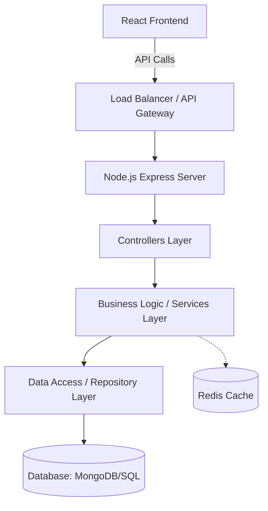

# SDE Documentation: LMS Project Architecture & Engineering

This document outlines the Software Development Engineering (SDE) concepts, system design, and architectural decisions for the SaaS Learning Management System (LMS). It serves as a guide for backend development, future enhancements, and understanding the core engineering principles applied in this project.

## 1. System Architecture & High-Level Design (HLD)

The application follows a **Microservices-ready Monolithic Architecture** (or modular monolith) with a clear separation of concerns using the **Controller-Service-Repository** pattern.



### Key Components:
- **Presentation Layer (Frontend)**: React.js (Vite) handling UI/UX.
- **Application Layer (Backend)**: Node.js/Express.
  - **Controllers**: Handle HTTP requests, validation, and sending responses.
  - **Services**: Contain core business logic (e.g., "Student cannot enroll if course is full").
  - **Repositories**: Direct database interactions, abstracting the query logic.
- **Data Layer**: Persistent storage (MySQL) and Caching (Redis).

---

## 2. Database Modeling & Schema Design

Effective database modeling is crucial for an LMS to handle complex relationships.

### Entities & Relationships

| Entity | Description | Relationships |
| :--- | :--- | :--- |
| **User** | Students, Instructors, Admins | 1:N with Enrollments, 1:N with CreatedCourses |
| **Course** | Learning material container | 1:N with Modules, M:N with Users (via Enrollments) |
| **Module** | Sections within a course | 1:N with Lessons/Assignments |
| **Content** | Video, Text, PDF | Belongs to Module |
| **Enrollment** | Record of Student in Course | Link Table (User_ID, Course_ID, Progress) |
| **Submission** | Student work for assignments | 1:1 with Assignment, Belongs to User |

### Schema Optimization
- **Indexing**:
  - `Compound Index` on `Enrollments(user_id, course_id)` for O(logN) lookup of specific enrollments.
  - `Text Index` on `Course(title, description)` for search functionality.
- **Sharding Key** (Future Scale): `user_id` or `institution_id` (for SaaS multitenancy).

---

## 3. Low-Level Design (LLD) & Design Patterns

We utilize standard OOP design patterns to ensure maintainability.

### A. Controller-Service-Repository Pattern
Separation of concerns is enforced:
- **Routes**: `router.get('/courses/:id', CourseController.getDetails)`
- **Controller**: `getDetails(req, res)` extracts `id` and calls Service.
- **Service**: `getCourseDetails(id)` checks rights, calculates extras.
- **Repository**: `findCourseById(id)` executes the DB query.

### B. Strategy Pattern (Authentication)
Used for handling multiple auth providers (Email/Pass, Google OAuth, SSO).
- `AuthStrategy` interface with `authenticate()` method.
- `GoogleAuthStrategy` and `LocalAuthStrategy` implement this interface.

### C. Observer Pattern (Notifications)
When an event occurs (e.g., "Assignment Graded"), multiple actions might be triggered (Email, Push Notification, Audit Log).
- **Subject**: `GradeSubmissionService`
- **Observers**: `EmailNotifier`, `PushNotifier`, `ActivityLogger`.

---

## 4. API Design (RESTful Best Practices)

We follow standard HTTP semantics and resource-oriented URLs.

### Endpoints
- **GET /api/v1/courses**: List courses (support pagination).
- **GET /api/v1/courses/{id}**: Get detailed course info.
- **POST /api/v1/courses/{id}/enroll**: Enroll current user.
- **PATCH /api/v1/users/profile**: Update partial profile.

### Best Practices Enforced
- **Versioning**: All APIs prefixed with `/v1` to allow future breaking changes without disrupting clients.
- **Status Codes**:
  - `200 OK` (Standard success)
  - `201 Created` (Resource created)
  - `400 Bad Request` (Validation error)
  - `401 Unauthorized` (Not logged in)
  - `403 Forbidden` (Logged in but no permission)
- **Response Wrapper**: Standardized JSON structure.
  ```json
  {
    "success": true,
    "data": { ... },
    "meta": { "page": 1, "limit": 10 }
  }
  ```

---

## 5. Data Structures & Algorithms (Applied)

Where CS fundamentals are applied in this LMS:

### A. Course Prerequisites (Graphs)
- **Problem**: A student cannot take "Advanced Math" before "Basic Math".
- **DS**: **Directed Acyclic Graph (DAG)**.
- **Algo**: **Topological Sort** or DFS to detect circular dependencies (e.g., A requires B, B requires A).

### B. Search Functionality (Tries / Inverted Index)
- **Problem**: Fast autocomplete for course searching.
- **DS**: **Trie (Prefix Tree)**.
- **Benefit**: O(L) lookup time where L is the length of the search term, significantly faster than SQL `LIKE %term%` for large datasets.

### C. Leaderboard (Heaps)
- **Problem**: Show top 10 students by XP/Grade.
- **DS**: **Min-Heap** (maintain top K).
- **Optimization**: Maintaining a heap of size K allows identifying top elements in O(N log K) which is better than full sort O(N log N) for massive datasets.

### D. Caching (Hash Maps)
- **Problem**: Repeatedly fetching "Course Categories" which barely change.
- **DS**: **Hash Map (Redis)**.
- **Key-Value**: `KEY: "categories_IS"`, `VALUE: JSON String`. Reduces DB load by 90%.

---

## 6. Time & Space Optimization Strategies

### 1. Pagination (Cursor-based vs. Offset-based)
- **Current**: Offset-based (`LIMIT 10 OFFSET 50`).
  - *Drawback*: Slow for large datasets (DB scans 50 records to skip them).
- **Future Enhancement**: Cursor-based.
  - Returns a pointer to the last item. Query: `WHERE id > last_seen_id LIMIT 10`. O(1) fetch time utilizing indexes.

### 2. Debouncing & Throttling
- **Frontend**: Search bar input is debounced (300ms) to prevent API spam.
- **Backend**: Ratelimiting (e.g., `express-rate-limit`) to prevent DDoS or abuse (100 req/min IP).

### 3. Database N+1 Query Problem
- **Issue**: Fetching 10 courses, then running 10 separate queries to get "Author Name" for each.
- **Solution**: **Population / Aggregation Pipeline**. Fetch courses and join authors in a single query (SQL `JOIN` or MongoDB `$lookup`).

---

## 7. Future Enhancements & Roadmap

1.  **Event-Driven Architecture**: Introduce **Kafka/RabbitMQ** to handle video processing asynchronously. When a video is uploaded, a message is sent to the queue, and a worker service picks it up for transcoding (using FFMPEG) without blocking the main API.
2.  **GraphQL Support**: Add a GraphQL layer for clients requiring flexible data fetching (preventing over-fetching/under-fetching).
3.  **Analytics Engine**: Implement a columnar store (e.g., ClickHouse) or data warehouse pipeline for heavy analytics (e.g., "Average time spent logic per module").
4.  **AI Integration**:
    - **RAG (Retrieval-Augmented Generation)**: Vector embeddings (ChromaDB) for course content to allow "Chat with your Course".
    - **Personalized Recommendations**: Collaborative filtering algorithms based on user enrollment patterns.

